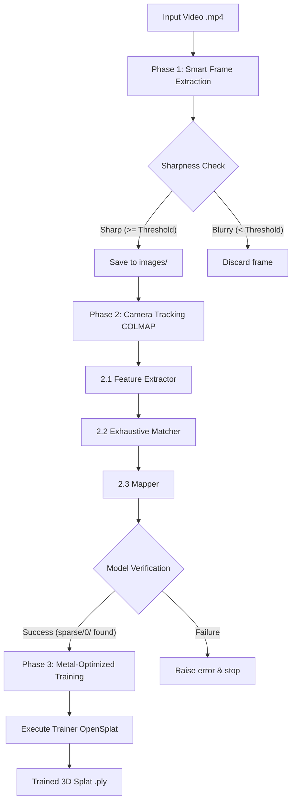

# macOS Gaussian Splatting Automation Pipeline

An end-to-end automated pipeline for generating 3D Gaussian Splats (`.ply` format) from raw video files (`.mp4`), optimized for macOS and Apple Silicon. 

This repository is structured to hand off execution to a target machine with full GPU support (Apple Silicon with Metal/MPS acceleration).

---

## Architecture Overview

The pipeline executes three sequential phases via [pipeline.py](file:///Users/liam_yehudai/GSplatMaker/pipeline.py):



---

## Target Machine Setup (Handoff Instructions)

If you are setting up this project on a new Mac, follow these steps to build and run the pipeline with full GPU acceleration.

### 1. GPU / Metal Compiler Prerequisites
To utilize the Mac's GPU during the training phase, you must have the full **Xcode** application installed (not just Command Line Tools), as it provides the `metal` shader compiler.

1. Install **Xcode** from the Mac App Store.
2. Accept the Xcode software license agreement:
   ```bash
   sudo xcodebuild -license accept
   ```
3. Set Xcode as the active developer directory:
   ```bash
   sudo xcode-select -s /Applications/Xcode.app/Contents/Developer
   ```

### 2. System Dependencies
Install Homebrew packages required for feature extraction, mapping, and compilation:
```bash
brew install colmap cmake pytorch opencv
```

### 3. Clone and Build OpenSplat (Metal-Enabled)
OpenSplat is a high-performance trainer optimized for Apple Silicon. Compile it locally with Metal/MPS GPU runtime enabled:

```bash
# Clone the repository recursively (includes necessary submodules)
git clone --recursive https://github.com/pierotofy/opensplat.git

# Create build directory
mkdir -p opensplat/build

# Configure build with Metal (MPS) support
cmake -S opensplat -B opensplat/build -DCMAKE_BUILD_TYPE=Release -DGPU_RUNTIME=MPS

# Compile utilizing all available CPU cores
cmake --build opensplat/build --config Release -j$(sysctl -n hw.ncpu)
```
The compiled binary will be generated at `./opensplat/build/opensplat`.

### 4. Python Environment Setup
Create a local Python virtual environment to manage dependencies without interfering with the system Python:

```bash
# Create virtual environment
python3 -m venv .venv

# Activate virtual environment
source .venv/bin/activate

# Install required libraries
pip install opencv-python numpy
```

---

## Actionable Run Commands

Once the setup is complete, run the pipeline with your input video. 

### 1. Run Pipeline (GPU Enabled)
Run the script using the virtual environment's Python and specify the path to the newly compiled OpenSplat binary:

```bash
./.venv/bin/python pipeline.py --video /path/to/video.mp4 --opensplat-path ./opensplat/build/opensplat
```

### 2. Quick Test Configuration (Fewer Iterations)
Since the default is `30000` training iterations, you can test if the pipeline executes successfully by running a shorter session (e.g., `5000` iterations):
```bash
./.venv/bin/python pipeline.py \
  --video /path/to/video.mp4 \
  --opensplat-path ./opensplat/build/opensplat \
  --num-iters 5000
```

### 3. Lowering Sharpness Threshold
If the pipeline discards too many frames (due to motion blur or low-light situations), lower the sharpness threshold (default is `100.0`):
```bash
./.venv/bin/python pipeline.py \
  --video /path/to/video.mp4 \
  --opensplat-path ./opensplat/build/opensplat \
  --sharpness-threshold 50.0
```

---

## Pipeline Log Files
All log outputs for the pipeline run will be stored in your specified workspace folder under `<workspace>/logs/`:
* `colmap_feature_extraction.log`
* `colmap_matching.log`
* `colmap_mapping.log`
* `training.log`
